  

 

 

---

  
   
  <h3><b>Google Summer of Code 2026 Contributor @ Liquid Galaxy</b></h3>

 

 

**Hacktoberfest 2025 badges**

---

> Hi, I'm Harsh (not the english word "harsh" ^_^). 
> **SDE Intern at Quantifai.** Experience in full-stack development, cybersecurity, 
> and AI — and a lot of AI agents, because why not.

I love to build and break at the project level. I love systems design.

- **Open to collaborate on:** Interesting & impactful projects … crazy & humorous ones too
- **Reach me:** [mehtaharsh3012@gmail.com](mailto:mehtaharsh3012@gmail.com)
- **Fun fact:** Don't book a judge by its cover.

  

---

